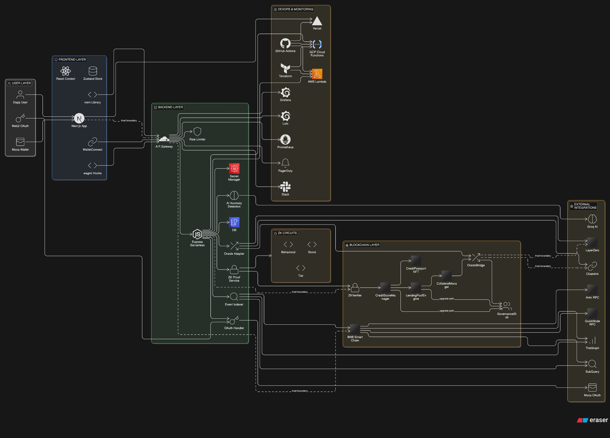

# CredLink ZK — Privacy-Preserving Credit Infrastructure on BNB Chain

[](https://www.bnbchain.org/)
[](LICENSE)
[-green?style=for-the-badge)](https://testnet.bscscan.com/)
[](https://soliditylang.org/)
[](https://docs.circom.io/)
[](https://frontend-theta-ochre-49.vercel.app)

**Your blockchain history IS your credit.** CredLink ZK lets anyone prove their creditworthiness across borders using zero-knowledge proofs — without revealing wallet balances, transaction history, or financial strategies.

> *"My friend moved from India to Germany. He had 3 years of on-chain freelance income but no bank credit history. He couldn't get a car loan to start his business."*
>
> CredLink ZK fixes this.

---

## Value Proposition

CredLink ZK bridges the gap between on-chain behavioral history and real-world credit access. Users get:

- **ZK Credit Proofs** — Prove wallet age, repayment history, and default rates without exposing raw data
- **Portable Credit Passport** — Soulbound NFT that travels with you across borders and chains
- **Reduced Collateral** — Earn 110% collateral (vs 150% standard DeFi) through proven behavior
- **Self-Custody** — Connect wallet, generate proof, borrow; no KYC documents needed
- **AI Risk Assessment** — Groq-powered natural language credit analysis and Sybil detection

---

## Problem → Solution

| Problem | Solution |
|---------|----------|
| Credit history doesn't cross borders — 281M migrants restart from zero | ZK-verified on-chain behavioral scoring creates a portable credit identity |
| DeFi lending requires 150% collateral regardless of history | Tier-based system: 110% (Platinum) to 150% (Bronze) based on proven behavior |
| Credit scoring exposes full financial history to lenders and MEV bots | Zero-knowledge proofs reveal only "Tier 3 approved" — nothing else |
| No incentive to build on-chain reputation | Asymmetric scoring (+50 repay, -100 default) rewards consistent behavior |
| Identity fraud and Sybil attacks erode trust | Moca Wallet binding enforces one-person-one-wallet-one-score |

---

## Target Users

- **Cross-border migrants** — Carry credit reputation from home chain to destination country
- **DeFi borrowers** — Unlock better collateral rates through behavioral proofs
- **Lenders / LPs** — Earn 4-8% APY with reduced counterparty risk via verified borrower tiers
- **Institutions** — Query on-chain credit passports as supplementary credit data (with user consent)

---

## User Journey

```
┌──────────────┐     ┌──────────────┐     ┌──────────────┐     ┌──────────────┐
│  Connect      │     │  Generate     │     │  Get Tier     │     │  Borrow with  │
│  Wallet       │────>│  ZK Proof     │────>│  & Score      │────>│  Less         │
│  (MetaMask)   │     │  (3 circuits) │     │  (0-1000)     │     │  Collateral   │
└──────────────┘     └──────────────┘     └──────────────┘     └──────────────┘
                                                                       │
┌──────────────┐     ┌──────────────┐     ┌──────────────┐            │
│  Score Goes   │     │  Mint Credit  │     │  Repay Loan   │<───────────┘
│  Up (+50)     │<────│  Passport NFT │<────│  On Time      │
│              │     │  (Soulbound)  │     │              │
└──────────────┘     └──────────────┘     └──────────────┘
```

---

## System Architecture



### Component Overview

| Component | Tech | Role |
|-----------|------|------|
| **Frontend** | Next.js 14, TypeScript, Tailwind, wagmi v2, viem | Dashboard, ZK proof UI, borrow/repay flows, credit passport |
| **Backend API** | Express.js, ethers.js v6 | Wallet analysis, identity binding, proof generation |
| **AI Engine** | Groq SDK (LLaMA 3-8B) | Risk assessment, Sybil anomaly detection |
| **ZK Circuits** | Circom 2.0, snarkjs, Groth16 | walletAgeProof, repaymentProof, defaultRatioProof |
| **Smart Contracts** | Solidity 0.8.20, OpenZeppelin 5.x | 7 contracts: scoring, lending, collateral, passport, oracle, governance |
| **Identity** | Moca Wallet, keccak256 | Sybil-resistant one-to-one wallet binding |

### Four-Layer Architecture

```
Layer 4: Lending & Liquidity     LendingPool ↔ CollateralManager ↔ GovernanceStub
Layer 3: Credit Scoring Engine   CreditScoreZK (0-1000 score, 4 tiers, decay system)
Layer 2: ZK Verification         ZKVerifier (3 Groth16 circuits → verified scores)
Layer 1: Identity                Moca Wallet binding + CreditPassportNFT (soulbound)
```

---

## Repository Structure

```
credlink-zk/
├── contracts/                  # 7 Solidity smart contracts
│   ├── CreditScoreZK.sol       # Core scoring engine
│   ├── LendingPool.sol         # Borrow/repay/liquidate
│   ├── CollateralManager.sol   # BNB escrow
│   ├── ZKVerifier.sol          # ZK proof validation
│   ├── CreditPassportNFT.sol   # Soulbound ERC721
│   ├── CrossChainScoreOracle.sol # Cross-chain bridge
│   └── GovernanceStub.sol      # Parameter registry
├── circuits/                   # Circom 2.0 ZK circuits
│   ├── walletAgeProof.circom
│   ├── repaymentProof.circom
│   └── defaultRatioProof.circom
├── frontend/                   # Next.js 14 application
│   ├── app/                    # Pages: dashboard, borrow, repay, travel, lender
│   ├── components/             # UI + 5 SVG chart components
│   ├── hooks/                  # useContractData, wagmi hooks
│   ├── lib/                    # zk-proof, moca-auth, contracts
│   └── contexts/               # AuthContext (Moca integration)
├── backend/                    # Express.js API server
│   └── routes/                 # credit, ai, identity, auth, passport
├── scripts/                    # Deployment scripts
│   └── deployAll.js            # Full deployment with role grants
├── assets/                     # Architecture diagrams
├── hackathonAudit.js           # On-chain compliance checker
├── Dockerfile                  # Production multi-stage build
├── docker-compose.yml          # One-command deployment
└── .env.example                # Environment template
```

---

## Setup & Run

### Prerequisites

- Node.js 18+
- Git
- MetaMask or compatible Web3 wallet
- BNB Testnet tokens from [BNB Chain Faucet](https://www.bnbchain.org/en/testnet-faucet)

### 1. Clone & Install

```bash
git clone https://github.com/SomeshTalligeriDEV/CredLink-ZK.git
cd credlink-zk

# Install root dependencies (Hardhat, contracts)
npm install

# Install frontend
cd frontend && npm install && cd ..

# Install backend
cd backend && npm install && cd ..
```

### 2. Environment Configuration

```bash
# Root .env (never commit)
PRIVATE_KEY=your_wallet_private_key
OPBNB_RPC_URL=https://data-seed-prebsc-1-s1.binance.org:8545/

# frontend/.env.local
NEXT_PUBLIC_CHAIN_ID=97
NEXT_PUBLIC_RPC_URL=https://data-seed-prebsc-1-s1.binance.org:8545/
NEXT_PUBLIC_CREDITSCORE_ADDRESS=0x5ED05A35D14cae38Bf7A73AeCF295320DA17dF33
NEXT_PUBLIC_LENDING_POOL_ADDRESS=0x53c95d8dAFBD171b28B9D874C02534e7b60390E5
NEXT_PUBLIC_COLLATERAL_MANAGER_ADDRESS=0xBbEd9274652F6e82f33D2777970b0719FE2f1F99
NEXT_PUBLIC_API_URL=http://localhost:3001

# backend/.env
PORT=3001
RPC_URL=https://data-seed-prebsc-1-s1.binance.org:8545/
CREDITSCORE_ADDRESS=0x5ED05A35D14cae38Bf7A73AeCF295320DA17dF33
ADMIN_PRIVATE_KEY=your_deployer_private_key
GROQ_API_KEY=your_groq_api_key
```

### 3. Run Development Servers

```bash
# Terminal 1: Backend API (port 3001)
cd backend && node server.js

# Terminal 2: Frontend (port 3000)
cd frontend && npm run dev
```

Open `http://localhost:3000` with MetaMask configured for BSC Testnet.

### 4. Smart Contracts (optional — already deployed)

```bash
npx hardhat compile
npx hardhat run scripts/deployAll.js --network bsctestnet
```

### 5. Docker (optional — one command)

```bash
cp .env.example .env
cp backend/.env.example backend/.env
# Edit both with your keys

docker-compose up -d
# Frontend: http://localhost:3000
# Backend:  http://localhost:3001
```

---

## Environment Variables

| Variable | Where | Description |
|----------|-------|-------------|
| `PRIVATE_KEY` | Root `.env` | Deployer wallet key (contracts only) |
| `NEXT_PUBLIC_CHAIN_ID` | `frontend/.env.local` | BSC Testnet: `97` |
| `NEXT_PUBLIC_RPC_URL` | `frontend/.env.local` | BSC Testnet RPC endpoint |
| `NEXT_PUBLIC_API_URL` | `frontend/.env.local` | Backend API URL |
| `NEXT_PUBLIC_CREDITSCORE_ADDRESS` | `frontend/.env.local` | CreditScoreZK contract |
| `ADMIN_PRIVATE_KEY` | `backend/.env` | Admin signer for on-chain writes |
| `GROQ_API_KEY` | `backend/.env` | Groq AI for risk assessment |
| `RPC_URL` | `backend/.env` | BSC Testnet RPC |

**No hardcoded secrets.** All sensitive values live in `.env` files (gitignored). `.env.example` templates provided.

---

## Deployed Contracts (BSC Testnet — Chain ID 97)

All 7 contracts are live with **100+ transactions each**.

| Contract | Address | Role |
|----------|---------|------|
| **CreditScoreZK** | [`0x5ED05A35D14cae38Bf7A73AeCF295320DA17dF33`](https://testnet.bscscan.com/address/0x5ED05A35D14cae38Bf7A73AeCF295320DA17dF33) | Core credit engine |
| **ZKVerifier** | [`0xc6a420075E19D85F350F0614A5153c4475b8718a`](https://testnet.bscscan.com/address/0xc6a420075E19D85F350F0614A5153c4475b8718a) | ZK proof validation |
| **LendingPool** | [`0x53c95d8dAFBD171b28B9D874C02534e7b60390E5`](https://testnet.bscscan.com/address/0x53c95d8dAFBD171b28B9D874C02534e7b60390E5) | Borrow / repay / liquidate |
| **CollateralManager** | [`0xBbEd9274652F6e82f33D2777970b0719FE2f1F99`](https://testnet.bscscan.com/address/0xBbEd9274652F6e82f33D2777970b0719FE2f1F99) | BNB collateral escrow |
| **CreditPassportNFT** | [`0x154F1EAB15a878b674cae2B8BF51eE179c4Dae05`](https://testnet.bscscan.com/address/0x154F1EAB15a878b674cae2B8BF51eE179c4Dae05) | Soulbound identity passport |
| **CrossChainScoreOracle** | [`0xc91Ef659166CBf9FeBEC263d32F1EDc41eaE1bfA`](https://testnet.bscscan.com/address/0xc91Ef659166CBf9FeBEC263d32F1EDc41eaE1bfA) | Cross-chain score bridge |
| **GovernanceStub** | [`0xE5376869F728D464Ae445322D81b2E0ff928a970`](https://testnet.bscscan.com/address/0xE5376869F728D464Ae445322D81b2E0ff928a970) | Protocol parameter registry |

**Role Grants Verified:**
- `VERIFIER_ROLE` on CreditScoreZK → ZKVerifier
- `LENDING_POOL_ROLE` on CreditScoreZK → LendingPool
- `LENDING_POOL_ROLE` on CollateralManager → LendingPool

---

## Zero-Knowledge Circuits

Three Circom 2.0 circuits produce Groth16 proofs that attest to behavioral properties without revealing underlying data.

| Circuit | Private Inputs | Public Output | What It Proves |
|---------|---------------|---------------|----------------|
| `walletAgeProof` | Wallet age in days | Pass/Fail | Wallet is older than 30 days |
| `repaymentProof` | Total loans, repaid loans | Pass/Fail | Repayment rate >= 80% |
| `defaultRatioProof` | Total loans, defaults | Pass/Fail | Default rate <= 20% |

**What the lender sees:** `"Tier 3 approved. Collateral: 110%."`
**What the lender does NOT see:** Wallet age, transaction count, balances, loan history, repayment amounts.

---

## Economic Model

### Tier-Based Collateral

| Tier | Score Range | Collateral | Capital Saved vs Standard DeFi |
|------|------------|------------|-------------------------------|
| Bronze | 0 – 199 | 150% | Baseline |
| Silver | 200 – 499 | 135% | 10.0% |
| Gold | 500 – 749 | 125% | 16.7% |
| **Platinum** | **750 – 1000** | **110%** | **26.7%** |

### Interest Rates & Lender APY

| Tier | Borrower Rate | Pool Utilization | Lender APY |
|------|-------------|-----------------|------------|
| Platinum | 2% | 0–40% | 4% |
| Gold | 3% | 40–70% | 6% |
| Silver | 4% | 70%+ | 8% |
| Bronze | 5% | — | — |

### Anti-Abuse Protection

| Mechanism | Constraint |
|-----------|-----------|
| Loan cooldown | 7 days between successive loans |
| Max active loans | 3 concurrent per borrower |
| Min repay delay | 1 hour (blocks flash loan attacks) |
| Same-block prevention | Cannot deposit and borrow in one tx |
| Anomaly scoring | 3 admin flags = borrowing blocked |
| Utilization cap | 80% max (20% liquidity reserve) |
| Asymmetric scoring | +50 repay / -100 default |
| Reputation decay | -20 at 180 days, -50 at 365 days inactive |

---

## API Endpoints

| Endpoint | Method | Description |
|----------|--------|-------------|
| `/api/credit/analyze` | POST | Analyze wallet behavior, return score + tier |
| `/api/credit/generate-proof` | POST | Generate Groth16 ZK proof structure |
| `/api/ai/risk-explanation` | POST | AI-powered risk assessment (Groq LLaMA 3) |
| `/api/ai/anomaly-detect` | POST | Sybil attack detection |
| `/api/identity/register` | POST | Bind Moca identity to wallet |
| `/api/identity/status/:wallet` | GET | Check identity + borrowing eligibility |
| `/api/auth/moca` | POST | Exchange Moca auth code for on-chain binding |
| `/api/passport/public/:wallet` | GET | Full credit passport (score, tier, ZK, Moca) |
| `/api/passport/public/:wallet/badge` | GET | ZK badge level + progression |
| `/api/health` | GET | Health check |

---

## Technical Highlights

- **Real BNB Chain integration** — wagmi v2, viem, BSC Testnet Chain 97 with 7 live contracts
- **Zero-Knowledge Proofs** — 3 Circom 2.0 circuits with Groth16 proving system
- **Soulbound NFT** — Non-transferable ERC721 with on-chain Base64 metadata
- **AI-powered risk** — Groq LLaMA 3-8B for natural language credit analysis
- **Moca Wallet** — Sybil-resistant identity binding (one person = one score)
- **Cross-chain ready** — Oracle contract deployed with BRIDGE_ROLE for LayerZero/Axelar
- **5 custom SVG charts** — Score evolution, capital efficiency, risk distribution, trust network, utilization
- **Cinematic intro** — 8-scene narrative experience for first-time visitors
- **Production Docker** — Multi-stage build, health checks, 512MB footprint

---

## Business Model

| Model | Description |
|-------|-------------|
| **Protocol fees** | 1% origination fee on each loan |
| **Tiered access** | Premium analytics and AI risk reports for institutional users |
| **Cross-chain licensing** | Score portability fees when bridging credit across chains |
| **Data marketplace** | Anonymized, aggregate credit trend data for DeFi protocols |

Current focus: **product-market fit and user adoption.** Revenue primitives are built into the contracts.

---

## GTM Strategy

- **Hackathon launch** — BNB Hack Bengaluru 2026; live demo to judges and builders
- **Migrant corridors** — Partner with remittance services (India→UAE, Philippines→Singapore)
- **DeFi integrations** — Composable credit scores for PancakeSwap, Venus, Radiant
- **Community** — Open-source contributions, BNB Chain Discord, DeFi forums
- **Institutional pilots** — Credit passport API for fintech lenders in MENA and SEA

---

## Roadmap

| Phase | Focus | Status |
|-------|-------|--------|
| **Phase 1** | 7 contracts deployed, ZK circuits, full lending lifecycle, AI risk engine | Done |
| **Phase 2** | Cross-chain credit portability via LayerZero/Axelar | Oracle deployed, bridge pending |
| **Phase 3** | DAO governance (Governor + Timelock), multi-sig admin | GovernanceStub ready |
| **Phase 4** | Production Groth16 verifier, recursive proof aggregation | Circuit architecture complete |
| **Phase 5** | Institutional API, migrant microcredit pools, Chainlink price feeds | Designed |

---

## Security Model

| Property | Implementation |
|----------|---------------|
| **Access Control** | OpenZeppelin RBAC: ADMIN, VERIFIER, LENDING_POOL, MINTER, BRIDGE roles |
| **Reentrancy** | ReentrancyGuard on all payable functions + CEI pattern |
| **Flash Loan Defense** | Same-block prevention + 1hr min lock + separate collateral escrow |
| **Sybil Resistance** | Bijective identity mapping + anomaly flagging + AI detection |
| **Score Integrity** | ZKVerifier sets absolute scores; LendingPool adjusts by fixed deltas only |
| **Collateral Safety** | Held in separate CollateralManager (not in lending pool) |
| **Secret Protection** | No private keys in frontend; backend-only signing; .env gitignored |

---

## Contributing

1. Fork the repository
2. Create a feature branch: `git checkout -b feature/your-feature`
3. Commit changes: `git commit -m 'Add your feature'`
4. Push: `git push origin feature/your-feature`
5. Open a Pull Request

---

## License

[MIT](LICENSE) — Open source. Fork, modify, and ship.

---

## Links

| Resource | URL |
|----------|-----|
| **Live Demo** | [frontend-theta-ochre-49.vercel.app](https://frontend-theta-ochre-49.vercel.app) |
| **Backend API** | [credlink-zk-backend.onrender.com](https://credlink-zk-backend.onrender.com) |
| **GitHub** | [SomeshTalligeriDEV/CredLink-ZK](https://github.com/SomeshTalligeriDEV/CredLink-ZK) |
| **BSCScan** | [Testnet Explorer](https://testnet.bscscan.com/) |

---

Built at **BNB Chain x YZI Labs Hackathon — Bengaluru 2026**.

Solving credit invisibility for 281 million cross-border migrants with zero-knowledge proofs on BNB Chain.
